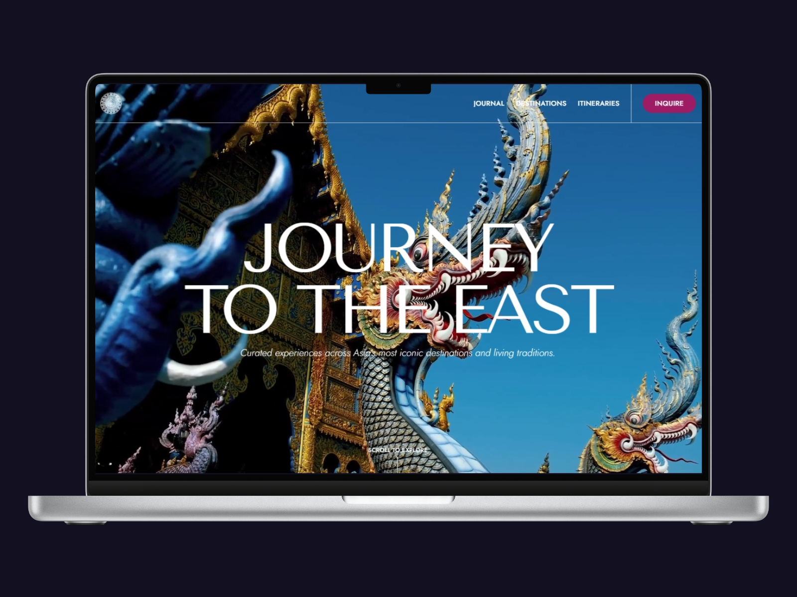
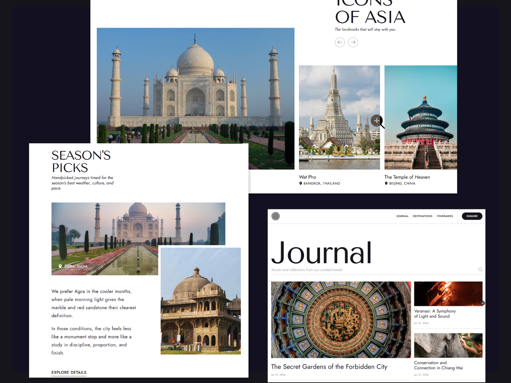
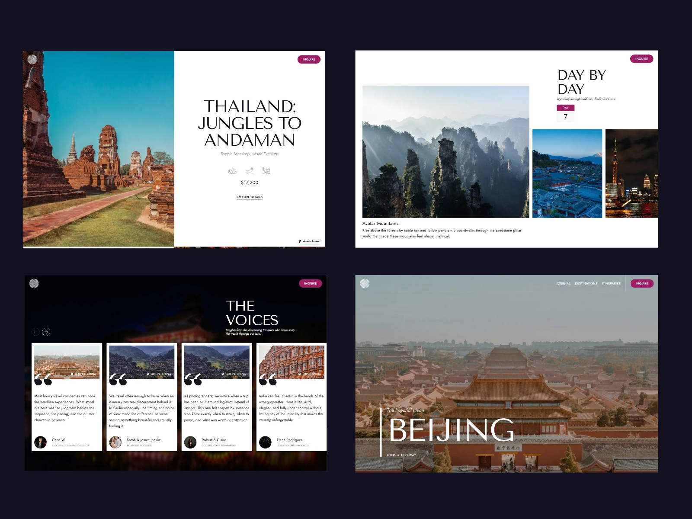
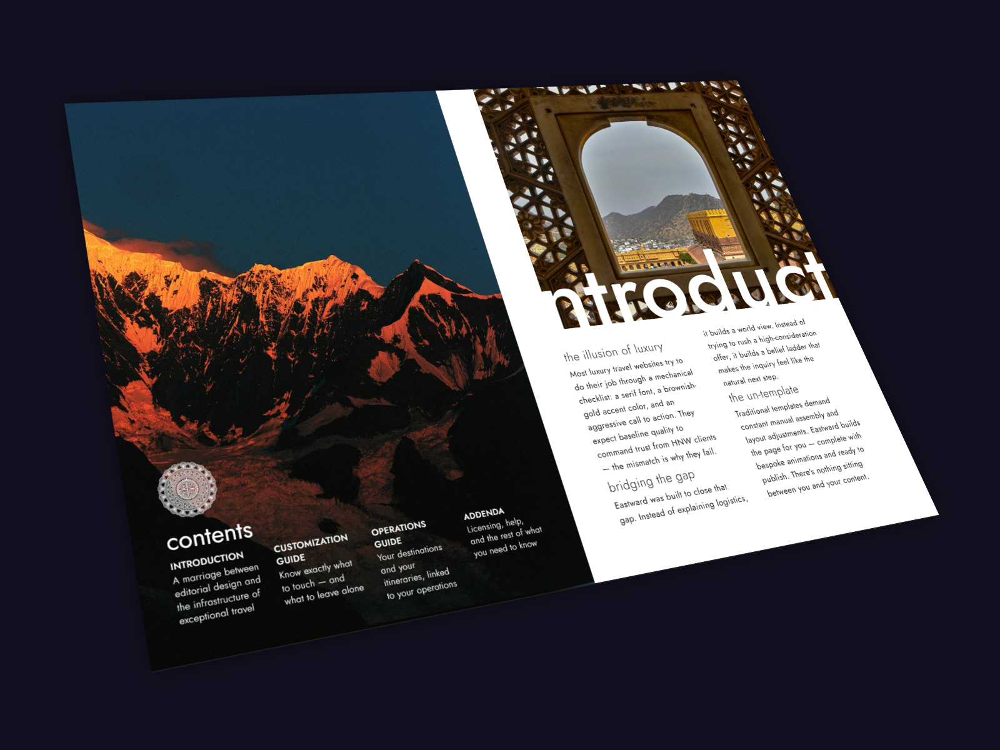

# Eastward — Astro Travel Theme

A luxury travel theme built with Astro.

| | |
| :---: | :---: |
|  |  |
|  |  |

## Features

- Editorial design system
- Custom GSAP animations
- Destination pages with MDX
- Itinerary layouts
- Journal with content collections
- Inquiry form
- Fully responsive

## Stack

- Astro
- Tailwind CSS
- GSAP

## Getting Started

```bash
pnpm install
pnpm dev
```

## Content

All content lives in `/src/content`:

- `/destinations` — destination pages
- `/itineraries` — multi-day itinerary layouts  
- `/journal` — editorial blog posts

Replace the demo content with your own. Images sourced from Unsplash.

## License

See `LICENSE` for full terms. Standard and Whitelabel tiers available.

## Built by

[Elliot Li](https://elliotli.dev)
